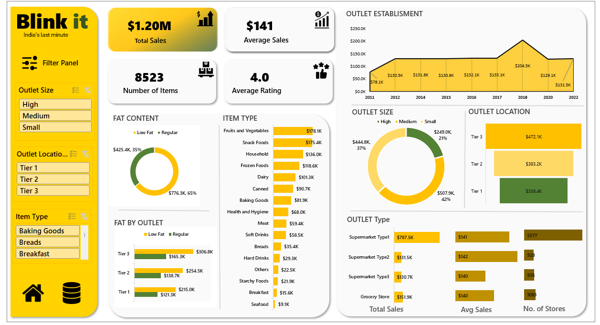

# Quick-Commerce-Business-Analytics

## Overview
This project analyzes the quick commerce electric vehicle (EV) market in India, focusing on data cleaning, market segmentation, sales trends, and outlet growth. The analysis uncovers actionable insights to inform strategic decisions.

## Dashboard

## Key Features

1. **Data Cleaning and Preparation**  
   - Processed raw data using **Excel**, handling **outliers**, **missing values**, and **unwanted entries**.  
   - Ensured data accuracy for deriving insights from key metrics such as sales, customer ratings, and product categories.

2. **Market Segmentation and Insights**  
   - Analyzed India's leading quick commerce EV market with **1.2M sales**, noting potential data anomalies in **8K items** and an average sale value of **141**.  
   - Identified customer preferences, with a **4.0 average rating**, and segmented sales based on fat content:  
     - **65% low-fat items**.  
     - **35% regular items**.  
   - Tier 3 cities lead in sales of low-fat products, whereas Tier 1 cities lag behind.

3. **Sales and Revenue Trends**  
   - Highlighted top-performing product categories:  
     - **Fruits and vegetables** with a total revenue of **$178K**.  
     - **Snack foods** contributing **$175K** to total revenue.  
   - Visualized trends in outlet establishments, showing consistent growth with **131K outlets in 2022**, dominated by supermarkets totaling **5,577 stores**.

## Tools and Techniques
- **Data Cleaning**: Excel.  
- **Data Visualization**: Charts for market segmentation, revenue trends, and outlet growth.  
- **Key Metrics**: Sales distribution, revenue by category, customer ratings, and outlet establishment trends.

## Insights
- Low-fat products dominate sales, particularly in Tier 3 cities, highlighting regional preferences.  
- Fruits and vegetables lead the revenue stream, offering significant potential for targeted promotions.  
- Supermarkets continue to dominate the retail landscape, reflecting opportunities for expansion in other formats.

## Future Scope
- Analyze customer behavior trends over time to refine marketing strategies.  
- Explore the impact of regional differences on product preferences.  
- Leverage predictive analytics to forecast future sales and outlet growth.